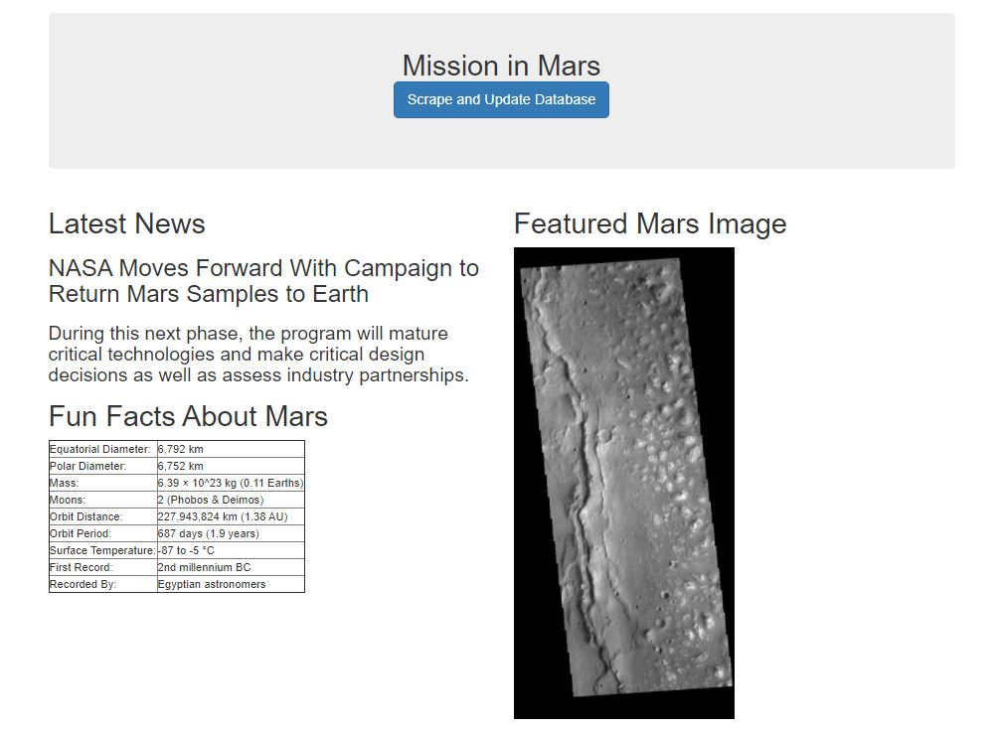
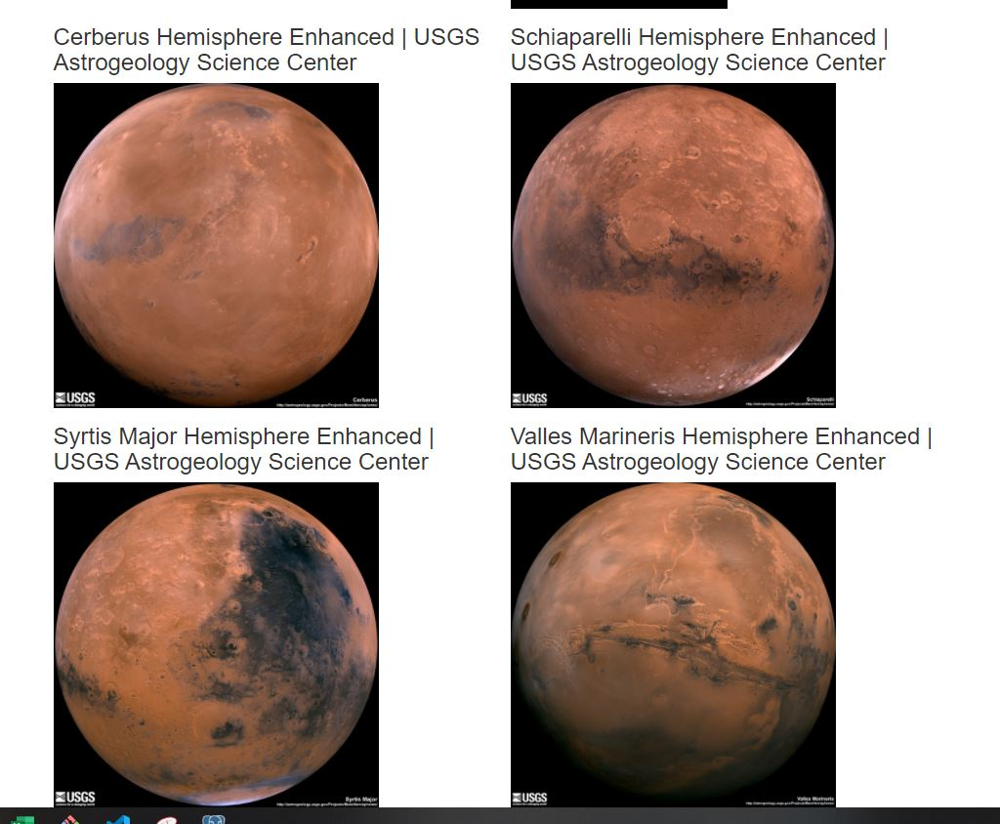

# Mars Scraping

- ## Intro
  - The objective of the project was to successfully scrape data from multiple space related websites and display the data on a webpage. After compiling the data that was scraped, I first stored it in a Mongo database. Once stored in the database, the data from our mongo database was stored on a webpage through a flask server. The webpage has a somewhat basic design and layout since this project is focused on scraping, using flask servers, and mongo databases.
- ## Programs and Languages
    - Jupyter Notebook
    - BeaufigulSoup
    - Pandas
    - Splinter
    - MongoDB
    - Flask
    - HTML
- ## Websites Used
    - https://mars.nasa.gov
    - https://www.jpl.nasa.gov
    - https://space-facts.com
    - https://astrogeology.usgs.gov

- ## File overview
  - ### [app.py](GitHub_Repositories\Completed\Mars_Scraping\Missons_to_Mars\app.py)
    ##### *the main application*
  - ### mission_to_mars.ipynb 
    ##### *used for initial development of scraping procedures*
  - ### scrape_mars.py
    ##### *this file is a cleaned-up py file version of mission_to_mars.ipynb. It contains  the scraping function that will be called in our main application file*
  - ### index.html
    ##### *this is the main page for the website that lists the scraped and stored data*
  - ### splash.html
    ##### *if you load the main page but the database is empty, you'll be redirected to this page while loading*

- ## Steps deployed to reach goal
    - ### Step 1 : Developing Scraping in Jupyter Notebook
        - I used splinter to manipulate the google chrome browser, pulling html from each site. Once I had the html for each site, I used beautifulsoup to parse the html. Initially, I set up the browser to visit each site, grab the html, parse the html, extract the data needed, then move onto the next site. However, I changed the order of these steps to limit the number of times the browser was opening and closing to increase efficiency.
    - ### Step 2 : Create Flask Server, Connect with Mongo, and Route Paths.
        - Used flask to create a Server which would host the webpage 
        - Used Pymongo to set-up the Mongo database
        - In the app file there are 2 main routes, one route being the homepage and one route being the scrape function.
    - ### Step 3: Combining Scraping process with Flask server Webpage and Mongo database through use of route paths.
        - Once the server and database were configured, I imported the scraping function into the app.py file. When the scrape button on the homepage is pressed, the user is directed to the "scrape" route which contains the execution of the scrape function. Once the data was scraped, the mongo database would be updated and the user would be redirected to the home route, which displays the scraped data.
    

- ## Findings and Conclusion
    - scraping data is useful and interesting. It seems like it would be more useful for one-off data retrieval instead of ongoing data retrieval considering the likelihood of a site's HTML and layout changing. Flask seems like a great tool for developing a webserver, however I'd like to see and use a version of Flask that could be used in deployment, not just development.
    - Images of final page:

    

    